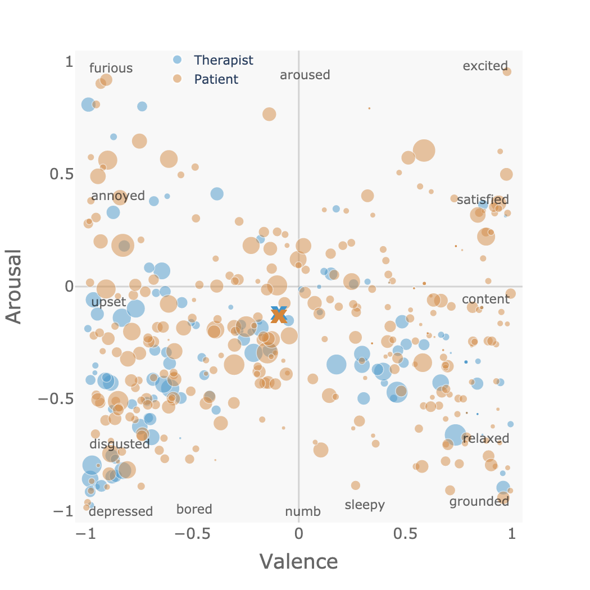

# COMPASS Pathways Two-dimensional Sentiment Model

<div align="center">

[](https://github.com/psf/black)
[](https://github.com/compasspathways/Sentiment2D/blob/main/.pre-commit-config.yaml)
[](https://creativecommons.org/licenses/by/4.0/)

A package for computing the two-dimensional sentiment scores and a Jupyter notebook for replicating the analysis described in the paper "[Psilocybin Therapy for Treatment Resistant Depression: Prediction of Clinical Outcome by Natural Language Processing](https://psyarxiv.com/kh3cx/)".

</div>

## Contents
The code and data to replicate the analysis described in our paper is in "integration_nlp_paper". The sentiment model code is in "sentiment2d" and an example that demonstrates the use of this model is in a notebook in "examples". Below is a plot of the 2D sentiment scores for the utterances in the Carl Rogers session with Gloria (see [the notebook](./examples/compute_sentiment.ipynb) for details). To view an interactive version of the plot with hover-text showing the utterances and scores, [download the html file](https://raw.githubusercontent.com/compasspathways/Sentiment2D/main/examples/sentiment.html) in examples and open it in a web browser.


## Notes
The sentiment model implemented here is exactly as described in the paper "[Psilocybin Therapy for Treatment Resistant Depression: Prediction of Clinical Outcome by Natural Language Processing](https://psyarxiv.com/kh3cx/)". However, due to study participant privacy considerations, the raw utterances are not shared here. However, we do include an example that uses a publicly available therapy session transcript from Carl Rogers' published [therapy session transcripts](https://anamartinspsicoterapiaacp.files.wordpress.com/2016/04/brodley-transcripts-of-carl-rogers-therapy-sessions.pdf).

Also due to privacy considerations, the raw data necessary to compute some of the figures and tables could not be publicly shared, and thus the notebook provided here will not exactly reproduce the paper figures and tables. However, the core code for computing the logistic regressions and the cross-validation loop are implemented as described in the paper, with the exception that the EBI PCA can not be computed in the CV loop as the individual EBI items can not be shared. However, the results are very similar to those obtained when including the PCA in the CV loop.

## Installation

```bash
python -m pip install -e git+https://github.com/compasspathways/Sentiment2D
```

## Citation

Please cite our paper titled "Psilocybin Therapy for Treatment Resistant Depression: Prediction of Clinical Outcome by Natural Language Processing". ([preprint](https://psyarxiv.com/kh3cx/))
